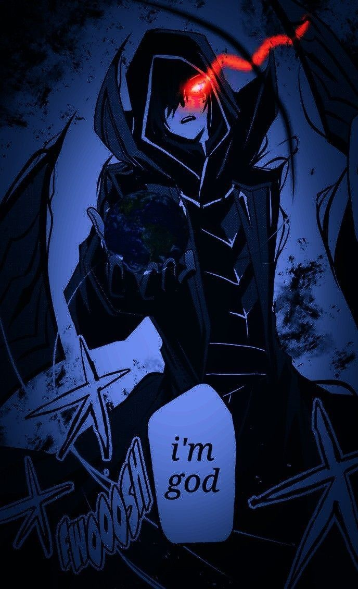

<body>
  

<h1 align="center">𝓦𝓮𝓵𝓬𝓸𝓶𝓮 𝓽𝓸 𝓶𝔂 𝓟𝓻𝓸𝓯𝓲𝓵𝓮</h1>
 

  

<h1 align="center">  𝓐𝓫𝓸𝓾𝓽 𝓶𝓮 </h1>

  <!--  -->

  

    

<dl>
    <dt align="left"><strong>Name:</strong></dt>
    <dd align="left">Iron Man</dd>
    <dt align="left">Loves:</dt>
    <dd align="left">Anime, Manga, Games</dd>
    <dt align="left">Hobbies:</dt>
    <dd align="left">Coding,
      Gaming,
      Reading</dd>
</dl>
 

  <h2>𝓛𝓪𝓷𝓰𝓾𝓪𝓰𝓮𝓼 𝓪𝓷𝓭 𝓕𝓻𝓪𝓶𝓮𝔀𝓸𝓻𝓴𝓼</h2>

  
  
  
  
  
  
  
  

  &nbsp;&nbsp;
  &nbsp;&nbsp;
  &nbsp;&nbsp;
  &nbsp;&nbsp;
  

  &nbsp;&nbsp;
  &nbsp;&nbsp;
  &nbsp;&nbsp;
  

 

    <h1> 𝓒𝓸𝓷𝓽𝓪𝓬𝓽 𝓜𝓮 </h1>

  
  
  
    

 

    <h1> 𝓢𝓾𝓹𝓹𝓸𝓻𝓽 𝓜𝓮 </h1>

  

 

    <h1> 𝓣𝓱𝓪𝓷𝓴𝓼 𝓕𝓸𝓻 𝓡𝓮𝓪𝓭𝓲𝓷𝓰 </h1>

_______________________

